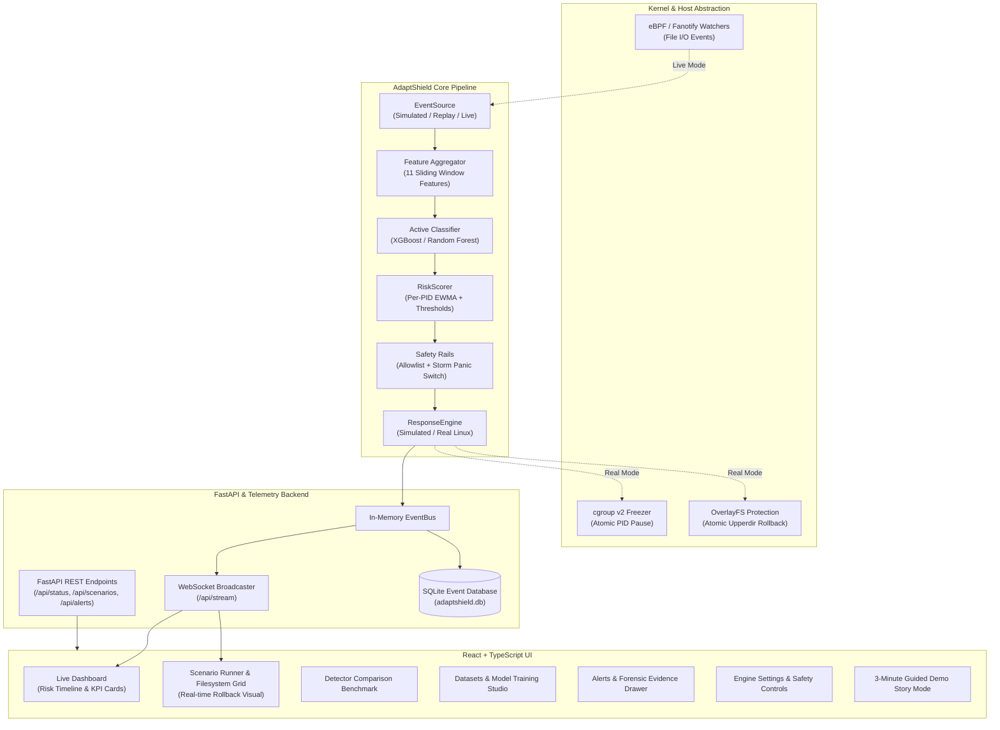

# AdaptShield: Autonomous Linux Ransomware Detection & Reversible Containment

[](https://github.com/adaptshield/adaptshield/actions/workflows/ci.yml)
[](LICENSE)
[](https://python.org)
[](https://fastapi.tiangolo.com)
[](https://vitejs.dev)

> **Defensive Security Notice:** AdaptShield is a defensive host-security research platform. All ransomware operations in this demonstration are simulated safely in user space using synthetic feature vectors and throwaway virtual files. Synthetic performance metrics do not imply guaranteed protection against zero-day physical binaries. Never run live malicious samples on production filesystems.

---

## Architecture Overview



---

## Key Features & UI Capabilities

1. **Live Dashboard (`/`):**
   - Persistent `SIMULATED DEMO DATA` badge, KPI metric cards, and batched WebSocket risk timeline.
   - Live Process table tracking per-PID risk EWMA, status, files touched, and manual containment override buttons (`Release` / `Confirm`).
2. **Scenario Runner & Filesystem Restoration (`/scenarios`):**
   - Execution controls for all 8 benchmark scenarios (`normal_workday`, `nightly_backup`, `fast_ransomware`, `slow_and_low`, `intermittent`, `partial_encryption`, `rename_then_encrypt`, `mixed_chaos`).
   - Virtual filesystem grid displaying intact files that visibly turn "encrypted" during attack, freeze at containment, and atomically restore upon rollback.
   - Detailed scenario report dialog with time-to-detect, files lost vs saved, latency breakdown, and JSON export.
3. **Detector Comparison Benchmark (`/comparison`):**
   - Side-by-side execution across Rule-Based Heuristic, Random Forest, and XGBoost detectors with deterministic seeds.
   - Comparative charts and metrics illustrating why ML minimizes detection delay and limits file exposure.
4. **Datasets Explorer & Model Training Studio (`/datasets`, `/models`):**
   - Inspect train/val/test/hard_test splits, schema specifications, class balance, and feature distributions.
   - Model registry tracking active status, evaluation curves (ROC/PR), and background training.
   - Interactive 11-feature "Try it" predictor with presets and live class probabilities.
   - Prominent **Hard Test Set Degradation** alert highlighting evasion limits (e.g. 34.7% recall on novel variants).
5. **Alerts & Forensics Hub (`/alerts`):**
   - Filterable security alert logs with evidence drawer detailing the full 11-feature snapshot and SHAP feature contributions.
6. **Engine Settings & Safety Rails (`/settings`):**
   - Dynamic threshold tuning ($\alpha$, $\theta_0$, window size), process allowlist manager, and demo state reset.
7. **3-Minute Guided Demo Story Mode:**
   - On-screen narrative walkthrough guiding evaluators through 5 distinct security scenarios with talking points and automated action triggers.

---

## Quickstart Guide

### Option A: Docker Compose (Recommended)

Ensure Docker and Docker Compose are installed:

```bash
# Clone the repository
git clone https://github.com/adaptshield/adaptshield.git
cd adaptshield

# Launch backend and frontend services
docker compose up --build -d
```

- Open the Frontend UI at: `http://localhost:5173`
- Backend REST API docs at: `http://localhost:8000/docs`

To stop services:
```bash
docker compose down
```

---

### Option B: Local Development Setup

#### Prerequisites
- Python 3.11+
- Node.js 20+ and npm

#### 1. Setup Python Environment & Dependencies
```bash
python -m venv .venv
source .venv/bin/activate  # On Windows: .venv\Scripts\activate
pip install -r requirements.txt
pip install -e .
```

#### 2. Generate Datasets & Train Models
```bash
make data    # Generates reproducible splits in data/raw/
make train   # Trains and registers benchmark models in models/registry/
```

#### 3. Run Backend API Server
```bash
python -m uvicorn backend.app.main:app --port 8000 --host 127.0.0.1
```

#### 4. Run Frontend Development Server
In a separate terminal:
```bash
npm --prefix frontend install
npm --prefix frontend run dev
```

Visit `http://localhost:5173` to interact with the full dashboard and scenario runner.

---

## Running the Automated Test Suite

```bash
# Run all unit tests (backend pytest + frontend vitest)
make test

# Or run separately:
make test-backend   # 58 pytest tests across datasets, ML, core, and API
make test-frontend  # 19 vitest tests across UI components and pages
```

---

## Documentation Links

- [System Architecture Specification](docs/architecture.md)
- [Limitations & Evasion Analysis](docs/limitations.md)
- [3-Minute Guided Demo Presenter Script](docs/demo_script.md)
- [Dataset Card & Schema Contract](data/DATASET_CARD.md)
- [Implementation Progress & Verification Status](docs/PROGRESS.md)

---

## Appendix: Bare-Metal Linux VM Deployment

When deploying to a physical Ubuntu VM with root privileges for live eBPF and cgroup enforcement:

```bash
chmod +x setup/*.sh
sudo ./setup/install_deps.sh          # Installs BCC, cgroups-tools, sysbench, venv
source .venv/bin/activate
sudo ./setup/make_test_filesystems.sh  # Mounts loopback filesystems
sudo ./setup/verify_all.sh             # Automated hardware preflight verification
```
