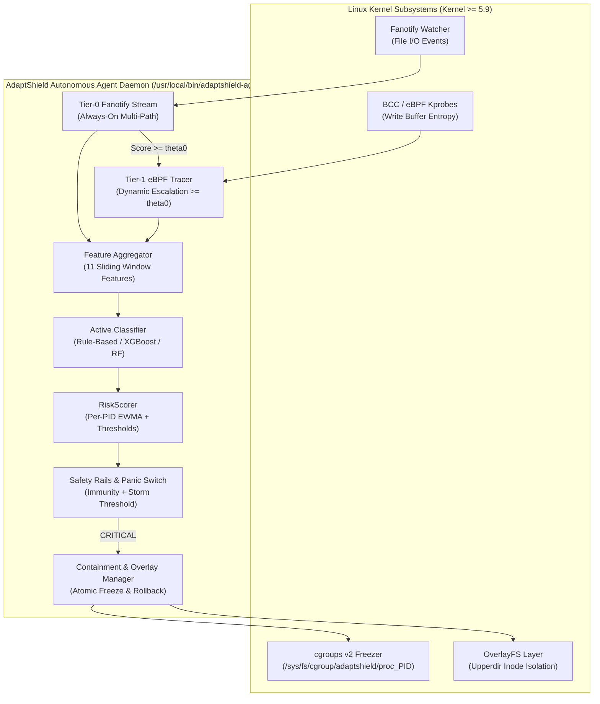

# AdaptShield: Autonomous Linux Ransomware Detection & Reversible Containment

[](https://github.com/saam-07/RansomRadar/actions/workflows/ci.yml)
[](LICENSE)
[](https://python.org)
[-orange.svg)](https://kernel.org)
[](docs/architecture.md)

> **Defensive Security Notice:** AdaptShield is an autonomous defensive host security agent and research platform. All demonstration workloads and benchmark datasets are executed safely in userspace using non-destructive simulators. AdaptShield never employs weaponized malware or destructive filesystem payloads.

---

## 1. System Architecture Overview

AdaptShield pairs high-speed Linux kernel event streaming with stateful risk modeling and reversible containment:



### Core Innovations:
1. **Two-Tier Event Streaming:** Always-on lightweight Tier-0 Fanotify stream dynamically escalates suspected processes ($\text{score} \ge \theta_0$) to Tier-1 eBPF write-buffer entropy tracing.
2. **Dedicated Per-PID cgroups v2 Containment:** Suspect processes are frozen inside isolated `/sys/fs/cgroup/adaptshield/proc_<pid>/` cgroups. Releasing or confirming one process has zero impact on concurrent sibling processes.
3. **Reversible OverlayFS Rollback:** Monitored directories are protected with an OverlayFS layer. Confirmed attacks are neutralized by atomically rolling back modified upperdir inodes and archiving evidence to quarantine.
4. **Machine Learning Seam with Synthetic Guard:** Plug-and-play classifier protocol with zero-crash fallback to deterministic rules. Built-in safety rails forbid synthetic-trained models from automated containment without explicit operator opt-in.

---

## 2. Production Linux Installation (Ubuntu 22.04 / 24.04)

### One-Command Quick Install
Run on a target Linux machine with root privileges:

```bash
git clone https://github.com/saam-07/RansomRadar.git
cd RansomRadar
sudo ./install.sh
```

### What `install.sh` Does:
- **Preflight Diagnostics:** Checks root, OS, kernel version ($\ge 5.9$), cgroups v2 freezer support, fanotify availability, and eBPF/BCC presence (never aborts if eBPF is missing; falls back cleanly to Tier-0-only mode).
- **Runtime Dependencies:** Installs minimal runtime dependencies (`python3-venv`, `cgroup-tools`, `inotify-tools`, `libcap2-bin`, `util-linux`).
- **Runtime Environment:** Builds an isolated venv at `/opt/adaptshield/venv` with `--system-site-packages`.
- **System Paths:** Sets up `/etc/adaptshield/config.yaml`, `/var/lib/adaptshield/`, and `/var/log/adaptshield/`.
- **Service Registration:** Installs and enables `adaptshield.service` under systemd.
- **PATH Symlinks:** Links `/usr/local/bin/adaptshield` and `/usr/local/bin/adaptshield-agent`.
- **Idempotent Upgrades:** Re-running `sudo ./install.sh --upgrade` updates software without overwriting `/etc/adaptshield/config.yaml`.

### Development & Benchmark Lab Setup
To install benchmark suites (`sysbench`, `mysql`, `postgresql`, `restic`) and loopback test filesystems:
```bash
sudo ./install.sh --dev
```

---

## 3. Uninstallation

```bash
# Standard uninstall (safely preserves quarantined files and configuration):
sudo ./uninstall.sh

# Complete purge (removes configuration, logs, and quarantined data):
sudo ./uninstall.sh --purge
```

---

## 4. Daemon Operating Modes

Configured in `/etc/adaptshield/config.yaml` or via `adaptshield mode <mode>`:

| Mode | Containment Behavior | Rollback Behavior | Use Case |
|---|:---:|:---:|---|
| **`monitor`** | Log only | Disabled | Observability, baseline assessment, testing |
| **`protect`** | Active (cgroups freeze + kill) | Enabled (OverlayFS) | Active production defense |
| **`learn`** | Log only | Disabled | Telemetry recording for offline training |

> **24-Hour Monitor-First Grace Period:** Fresh installations start with a 24-hour learning period in `monitor` mode by default (`monitor_first_period_hours: 24`). The daemon automatically switches to `protect` mode once the grace period elapses. Set to `0` to enable active protection immediately.

---

## 5. Unified CLI Reference (`adaptshield`)

```bash
# System Diagnostics & Status
adaptshield status                  # Daemon status, active mode, uptime, counters, detector type
adaptshield doctor                  # Hardware & kernel preflight checks (cgroups, fanotify, BCC, model)
adaptshield version                 # Version and environment information

# Live Control & Monitoring
adaptshield run [--dry-run]         # Run daemon in foreground (used by systemd or for debugging)
adaptshield alerts [-f] [--since 1h] # Stream or query structured alert records
adaptshield mode [monitor|protect|learn] # Inspect or change operating mode

# Per-PID Containment & Manual Review
adaptshield list                    # List currently frozen and pending-review processes
adaptshield show <pid>              # Inspect evidence and feature snapshot for a contained PID
adaptshield release <pid>           # False alarm: thaw process cgroup and mark false-positive
adaptshield release --all           # Thaw all currently frozen processes
adaptshield confirm <pid>           # True positive: quarantine touched files, rollback overlay, kill PID

# Configuration & Allowlists
adaptshield config show             # Print active YAML configuration
adaptshield config check            # Validate syntax and parameters of config.yaml
adaptshield allowlist list          # List immune processes and binaries
adaptshield allowlist add <name>    # Add process to safety allowlist

# Machine Learning Lifecycle
adaptshield model info              # View active model architecture, metrics, and schema version
adaptshield model reload            # Hot-reload model from registry without restarting daemon
adaptshield model rollback          # Rollback to previous model artifact
adaptshield train [--classifier ...] # Train classifier on local flight telemetry
adaptshield evaluate                # Evaluate models against test splits and hard evasion sets

# Safe Demonstrations
adaptshield simulate benign         # Generate safe normal file modifications
adaptshield simulate ransomware     # Run safe simulated encryption loop against sandbox directory
```

---

## 6. Machine Learning Seam & Plug-in Workflow

AdaptShield enforces an 11-feature canonical contract across all detectors:
- **Tier-0 Features:** `mod_rate`, `rename_rate`, `create_del_rate`, `event_count`, `concentration_gini`
- **Tier-1 Features:** `t1_write_rate`, `t1_mean_entropy`, `t1_entropy_std`, `t1_unlink_rate`, `t1_rename_rate`, `t1_mean_write_size`

### Adding a New Model:
1. Implement the `Classifier` protocol (`src/adaptshield/ml/classifier.py`).
2. Train on benchmark data or flight telemetry:
   ```bash
   adaptshield train --classifier xgboost --data data/raw/traces_train.csv
   ```
3. Copy model artifact to `/var/lib/adaptshield/models/` and update `registry_manifest.json`.
4. Hot-reload into the running daemon:
   ```bash
   adaptshield model reload
   ```
5. If validation fails, AdaptShield retains the previous model with zero service disruption.

---

## 7. Fullstack Web Demo Visualizer

For interactive demonstrations and visual evaluations, AdaptShield includes a complete FastAPI + React web interface:

```bash
# Launch with Docker Compose:
docker compose up --build -d

# Open browser:
# Frontend Dashboard: http://localhost:5173
# REST API Swagger:   http://localhost:8000/docs
```

Interactive capabilities include:
- **Live Process Table & Risk EWMA Timeline**
- **Scenario Runner:** 8 benchmark scenarios (`normal_workday`, `fast_ransomware`, `mixed_chaos`, etc.)
- **Interactive Virtual Filesystem Grid:** Files visibly turn "encrypted" during attacks and restore upon rollback
- **Detector Comparison Studio:** Side-by-side benchmarking (Rule-Based vs Random Forest vs XGBoost)
- **Forensic Evidence Drawer & 3-Minute Guided Demo Story Mode**

---

## 8. Limitations & Operational Boundaries

Defensive security requires transparency regarding capabilities and boundaries:

1. **Not a Replacement for Backups:** AdaptShield is an active host containment system. It does not replace immutable, air-gapped, or offsite backups (e.g. `restic`, `borg`, WORM storage).
2. **OverlayFS Scope:** Automated rollback relies on OverlayFS upperdir isolation. Filesystems that do not support OverlayFS lower/upper directories or cross mount points cannot support rollback; for these paths, AdaptShield operates in fallback `quarantine-copy-on-detect + freeze/kill` mode.
3. **Kernel Requirements:** Accurate per-PID attribution via fanotify requires Linux kernel $\ge 5.9$.
4. **Synthetic Data Caveat:** Baseline models were trained on synthetic benchmark traces to validate plumbing. Models tagged `data_source: "synthetic"` are barred from unattended containment in `protect` mode by default.
5. See [`docs/limitations.md`](docs/limitations.md) and [`docs/filesystem_limitations.md`](docs/filesystem_limitations.md) for detailed technical constraints.

---

## 9. Verification & Automated Tests

Run the test suite:
```bash
# Run all unit tests (cross-platform):
pytest tests/ -v

# Verification checklist for physical or virtual Ubuntu machines:
cat docs/installer_verification.md
```

---

## Documentation Links
- [System Architecture](docs/architecture.md)
- [ML Integration & Model Seam](docs/ml_integration.md)
- [Threat Model & Security Boundaries](docs/threat_model.md)
- [Limitations & Operational Boundaries](docs/limitations.md)
- [Installer VM Verification Checklist](docs/installer_verification.md)
- [Agent Acceptance Report](docs/agent_acceptance_report.md)
- [Changelog](CHANGELOG.md)
- [Contributing](CONTRIBUTING.md)
