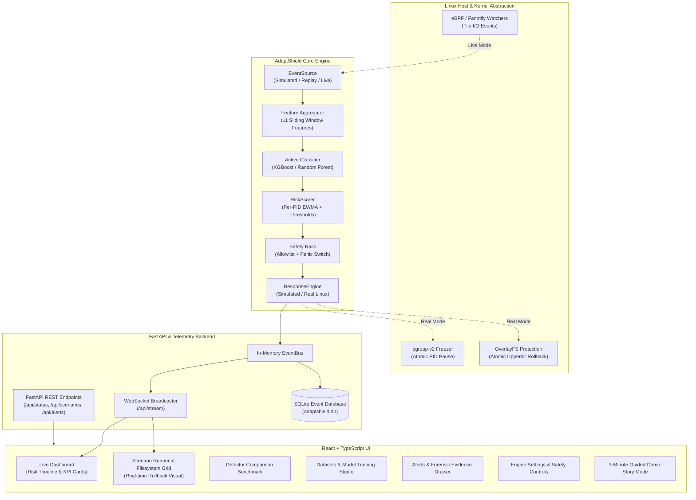

# AdaptShield System Architecture

---

## 1. Architectural Principles

1. **Defense-in-Depth:** Machine learning classification is never the single point of failure. AdaptShield pairs statistical inference with stateful exponential-moving-average (EWMA) risk accumulation, conservative confirmation windows, kernel safety rails, and atomic reversible snapshots.
2. **Strict Per-Process Isolation:** Every tracked PID maintains an independent RiskScorer instance and containment record. If two attackers execute concurrently, containing or releasing one PID has zero effect on the other.
3. **Reversible Containment:** Rather than immediately terminating suspect processes, AdaptShield pauses them via cgroup v2 freezer and isolates file modifications via overlayfs. In manual policy mode or false positive cases, operations can be seamlessly resumed without data loss.
4. **Transparent Explainability:** Every forensic alert carries a complete 11-feature snapshot vector alongside decision factor attributions (SHAP / tree feature contributions) to inform human security analysts.

---

## 2. Core Subsystems

### 2.1 Event Sources (`backend/app/core/sources.py`)
- **SimulatedSource:** Deterministic scenario replay driving virtual processes according to parameter seeds and configurable playback speed (1x, 5x, 20x).
- **ReplaySource:** Replays historical trace CSV datasets grouped by process PID.
- **LiveAgentSource:** Feature-flagged stub for reading live agent telemetry (`/var/log/adaptshield/alert.jsonl`).

### 2.2 Feature Aggregator (`adaptshield/feature_aggregator.py`)
Extracts 11 temporal and structural features per sliding time window:
- `event_count`, `mod_rate`, `create_del_rate`, `rename_rate`, `concentration_gini`
- Tier-1 eBPF entropy metrics: `t1_write_rate`, `t1_mean_entropy`, `t1_entropy_std`, `t1_unlink_rate`, `t1_rename_rate`, `t1_mean_write_size`

### 2.3 Detection Pipeline & Risk Scoring (`backend/app/core/pipeline.py`)
- **Classifier Inference:** Generates instantaneous ransomware probability $p_{\text{ransomware}} \in [0, 1]$.
- **Stateful EWMA Scoring:** Computes risk score $R_t = \alpha \cdot p_t + (1 - \alpha) \cdot R_{t-1}$.
- **Risk Escalation:** Escalates across WATCH ($\ge 0.30$), SUSPECT ($\ge 0.60$), and CRITICAL ($\ge 0.85$). CRITICAL requires $N$ consecutive windows above threshold to eliminate single-burst false alarms.

### 2.4 Safety Rails (`backend/app/core/safety.py`)
- **Hard-coded System Immunity:** PID 0, PID 1, PID 2, agent self-PID, and critical OS services (`systemd`, `sshd`, `dbus`, `dockerd`).
- **Configurable Application Allowlist:** Legitimate utilities (`rsync`, `tar`, `postgres`, `mysqld`, `git`).
- **Rate Limiting:** Upper bound on containment actions per minute.
- **False-Positive Storm Panic Switch:** If 5+ distinct PIDs trigger CRITICAL within 12 seconds, containment drops automatically to monitor mode.

### 2.5 Response Engine (`backend/app/core/response.py`)
- **SimulatedResponse:** Tracks virtual filesystem of 300 files across protected directories. Records atomic freeze, rollback, and unfreeze latencies (3-5 ms).
- **RealResponse:** Wraps Linux cgroup freezer and overlayfs unmount operations.

### 2.6 Streaming Telemetry & API (`backend/app/api/`)
- In-memory event bus connects the pipeline to a WebSocket broadcaster, delivering batched UI updates every 100ms.
- SQLite database persists scenario run histories, forensic alerts, and containment records.
