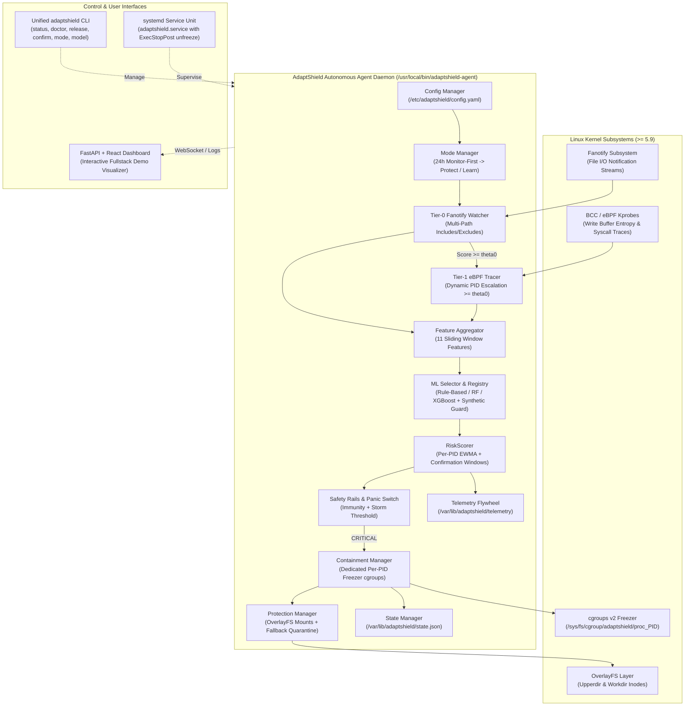

# AdaptShield Complete System Architecture Specification

## 1. System Overview & End-to-End Diagram

AdaptShield is a production-grade autonomous Linux endpoint security system engineered to detect ransomware behaviors and execute reversible, zero-data-loss containment.

---

## 2. Kernel & Event Streaming Subsystems

### 2.1 Tier-0 Multi-Path Fanotify Watcher (`detection/tier0_watcher.py`)
- Employs Linux `fanotify` (`fanotify_init` with `FAN_CLASS_NOTIF | FAN_REPORT_DFID_NAME`) to monitor filesystem events across all directories specified in `watch.paths`.
- **Exclusion & Self-Filtering:** Ignores path prefixes specified in `watch.excludes` (`/proc`, `/sys`, `/dev`, `/run`, `/tmp`, `/var/lib/adaptshield`, `/var/log/adaptshield`).
- **Self-PID Suppression:** Filters out events generated by the AdaptShield daemon PID and its children to prevent feedback loops.
- Computes windowed rates for:
  - `mod_rate`: modification rate ($Hz$)
  - `rename_rate`: file rename/move operations ($Hz$)
  - `create_del_rate`: combined file creation and deletion rate ($Hz$)
  - `event_count`: raw event throughput
  - `concentration_gini`: Gini inequality coefficient across targeted directory paths

### 2.2 Tier-1 eBPF Syscall & Entropy Tracer (`detection/tier1_bridge.py`)
- Implemented in C and loaded via BCC (`bpfcc-tools` / `python3-bpfcc`).
- Attached dynamically only for PIDs whose Tier-0 initial heuristic score satisfies $S_{\text{Tier-0}} \ge \theta_0$ (default 0.5).
- Hooks kernel tracepoints:
  - `sys_enter_write`: calculates Shannon entropy on initial 512-byte buffer segments in kernel space.
  - `sys_enter_unlinkat`: tracks file deletion syscalls.
  - `sys_enter_renameat2`: tracks file renames.
- **Graceful Fallback:** If BCC, kernel headers, or eBPF support are absent, AdaptShield automatically operates in **Tier-0-only mode**, filling Tier-1 feature columns with `NaN`.

---

## 3. Machine Learning Inference & Risk Accumulation

### 3.1 11-Feature Canonical Contract (`ml/schema.py`)
Input rows are validated against the schema contract:
- 5 Tier-0 filesystem features: `mod_rate`, `rename_rate`, `create_del_rate`, `event_count`, `concentration_gini`.
- 6 Tier-1 kernel features: `t1_write_rate`, `t1_mean_entropy`, `t1_entropy_std`, `t1_unlink_rate`, `t1_rename_rate`, `t1_mean_write_size`.

### 3.2 Classifier Auto-Selection & Synthetic Guard (`ml/selector.py`)
- Automatically inspects the active model in `/var/lib/adaptshield/models/`.
- **Synthetic Guard:** If a model is trained on synthetic data (`data_source: "synthetic"`), it is blocked from automated containment in `protect` mode unless `classifier.allow_synthetic: true` is explicitly enabled. If blocked, it defaults to `RuleBasedClassifier` while allowing synthetic models for `monitor` and `learn` modes.
- **Zero-Crash Resilience:** Missing, corrupted, or incompatible models seamlessly fall back to `RuleBasedClassifier`.

### 3.3 Stateful Risk Scoring (`detection/risk_scorer.py`)
- Computes per-PID exponential moving average (EWMA):
  $$R_t = \alpha \cdot p_t + (1 - \alpha) \cdot R_{t-1}$$
- Risk levels:
  - $\text{NONE} \to [0.0, 0.30)$
  - $\text{ELEVATED / WATCH} \to [0.30, 0.60)$
  - $\text{SUSPICIOUS} \to [0.60, 0.85)$
  - $\text{CRITICAL} \to [0.85, 1.0]$
- Requires $N$ consecutive windows (default 2) to confirm CRITICAL, preventing single-burst false alarms.

---

## 4. Safety Rails & Denial-of-Service Defense

### 4.1 Immunity Rails (`response/safety.py`)
- Guaranteed immunity for PID 1, kernel threads, systemd daemons, SSH, and DB servers.
- Configurable process name, binary path, and user allowlists.

### 4.2 False-Positive Storm Panic Switch
- Tracks distinct PIDs triggering CRITICAL within a sliding time window (default 30s).
- If distinct PIDs exceed threshold (default 5), the panic switch trips:
  - Containment actions are immediately suppressed.
  - Mode drops to `monitor`.
  - A high-severity `storm_panic_switch_tripped` security alert is generated.

---

## 5. Containment, OverlayFS Protection & Rollback

### 5.1 Dedicated Per-PID cgroups v2 Freezer (`response/containment_manager.py`)
- Every contained PID is isolated in its own dedicated cgroup:
  `/sys/fs/cgroup/adaptshield/proc_<pid>/`
- When a process is contained:
  `echo 1 > /sys/fs/cgroup/adaptshield/proc_<pid>/cgroup.freeze`
- **Independent Release:** Releasing or thawing PID $A$ has zero effect on frozen PID $B$.

### 5.2 OverlayFS Protection Manager (`response/protection.py`)
- Manages overlayfs mounts across all paths declared in `protect_paths`.
- Separates original filesystem data (lowerdir) from active writes (upperdir).
- Upon confirmed ransomware attack:
  1. Process is frozen in cgroups v2.
  2. Modified files in upperdir are copied to `/var/lib/adaptshield/quarantine/`.
  3. Overlay is remounted / cleaned, restoring original pre-attack file state atomically.
  4. Process is killed.
- **Reboot Remounting:** Manifest persisted at `/var/lib/adaptshield/overlay_manifest.json` ensures protected mounts are reconstructed on system boot.
- **Graceful Fallback:** If an un-overlayable path is watched, AdaptShield uses `quarantine-copy-on-detect + freeze/kill` and reports `rollback unavailable` in CLI status.

---

## 6. Operating Modes & Telemetry Flywheel

| Mode | Containment Action | Rollback Action | Telemetry Collection |
|---|:---:|:---:|:---:|
| `monitor` | Suppressed (Log alert only) | Disabled | Emits alert logs |
| `protect` | Enabled per `response.policy` | Enabled (Overlay) | Emits alerts + telemetry |
| `learn` | Suppressed (Zero disruption) | Disabled | Continuous feature rows to disk |

- **24-Hour Monitor-First Grace Period:** Upon initial installation, the daemon defaults to `monitor` mode for 24 hours to observe host baselines before automatically engaging active protection.
- **Flight Telemetry Flywheel (`telemetry.py`):** Automatically logs feature rows to `/var/lib/adaptshield/telemetry/` with 50 MB rotation caps for offline model retraining.
